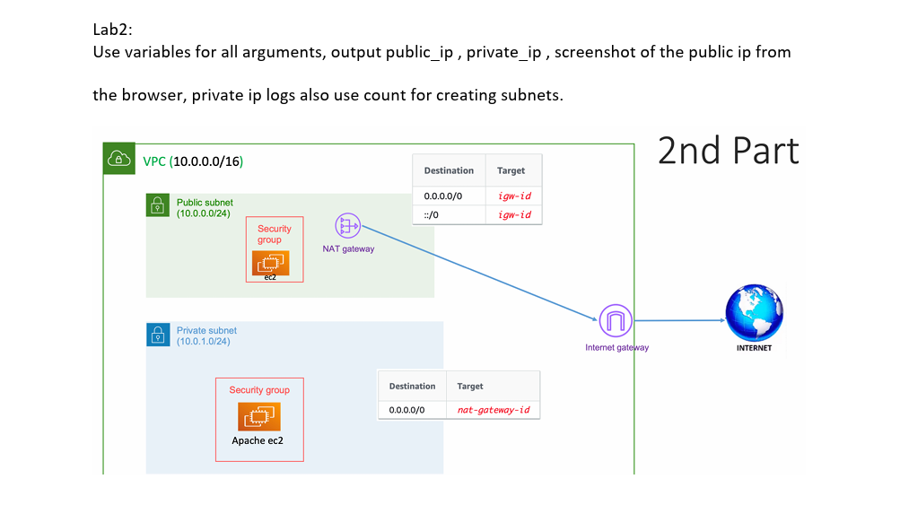
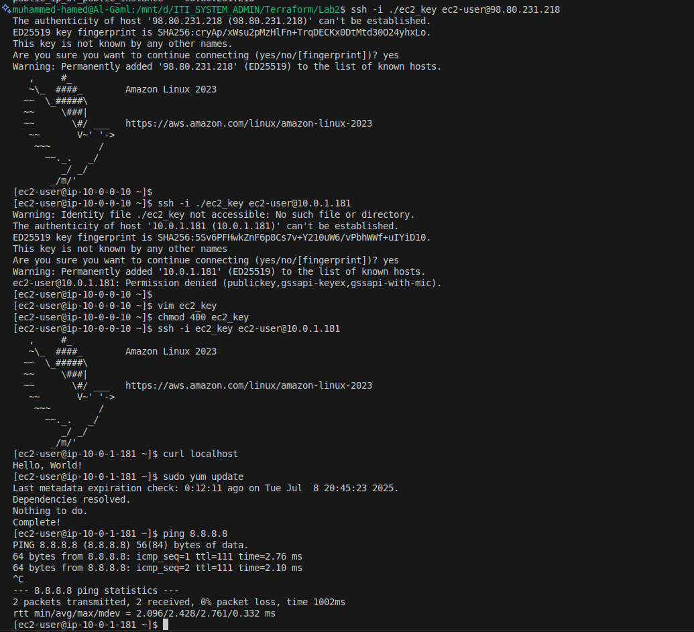

# ☁️ AWS VPC with EC2 in Public & Private Subnets + NAT Gateway (Terraform)

This Terraform project provisions a secure AWS environment with:

- A custom **VPC**
- **Public and Private Subnets**
- **Internet Gateway** for public access
- **NAT Gateway** for private subnet outbound internet access
- **EC2 instances**: one in public, one in private subnet
- **Key Pair** for SSH
- **Security Groups**
- Output values for quick access

---

## 🖼️ Architecture Diagram



---

## 📁 Project Structure

```bash
.
├── backend.tf          # (Optional) Remote backend configuration
├── ec2_key             # Private key for SSH
├── ec2_key.pub         # Public key for EC2 key pair
├── EC2.tf              # EC2 instances in public and private subnets
├── key.tf              # Key pair for EC2
├── output.tf           # Outputs for public/private IPs, etc.
├── provider.tf         # AWS provider config
├── README.md           # Documentation (you’re here)
├── sg.tf               # Security groups
├── variable.tf         # Input variables
└── vpc.tf              # VPC, subnets, IGW, NAT GW, route tables
```

## 🔧 Prerequisites
- **Terraform**: [Install Terraform](https://www.terraform.io/downloads)
- **AWS CLI**: [Install AWS CLI](https://docs.aws.amazon.com/cli/latest/userguide/getting-started-install.html)
- **AWS Credentials**: Configure the CLI with:
  ```bash
  aws configure
  ```
### Create Key Pairs 
 ```bash 
   ssh-keygen -t rsa -b 4096 -f ec2_key
  ```


#### 🚀 Usage


1. **Initialize Backend**
   ```bash
   terraform init

2. **Terraform plan**
   ```bash
   terraform plan   


3. **Terraform apply**
   ```bash
   terraform apply 


3. **Terraform CleanUp Delete resources**
   ```bash
   terraform destroy
-------





